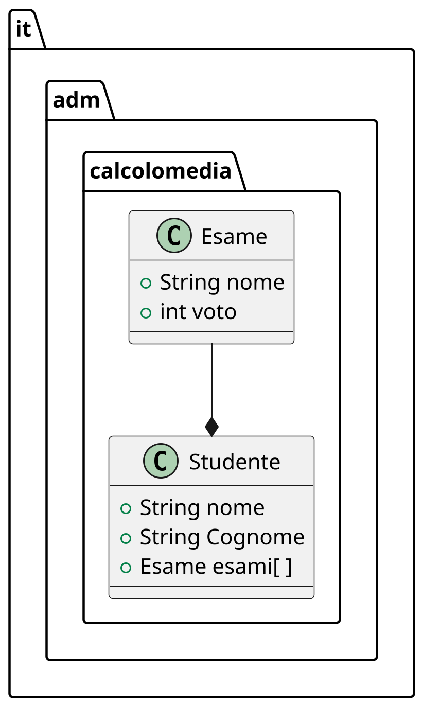
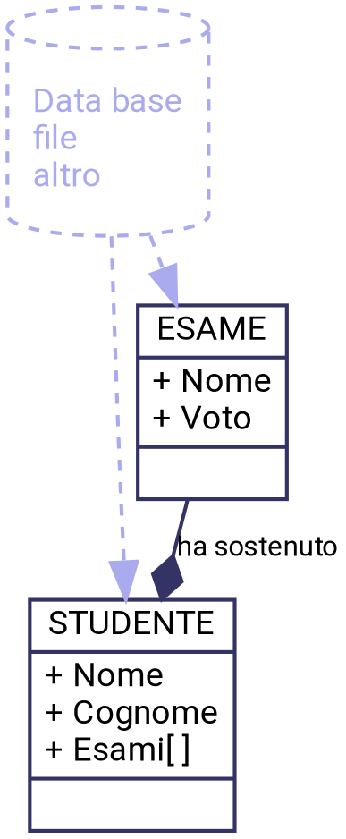
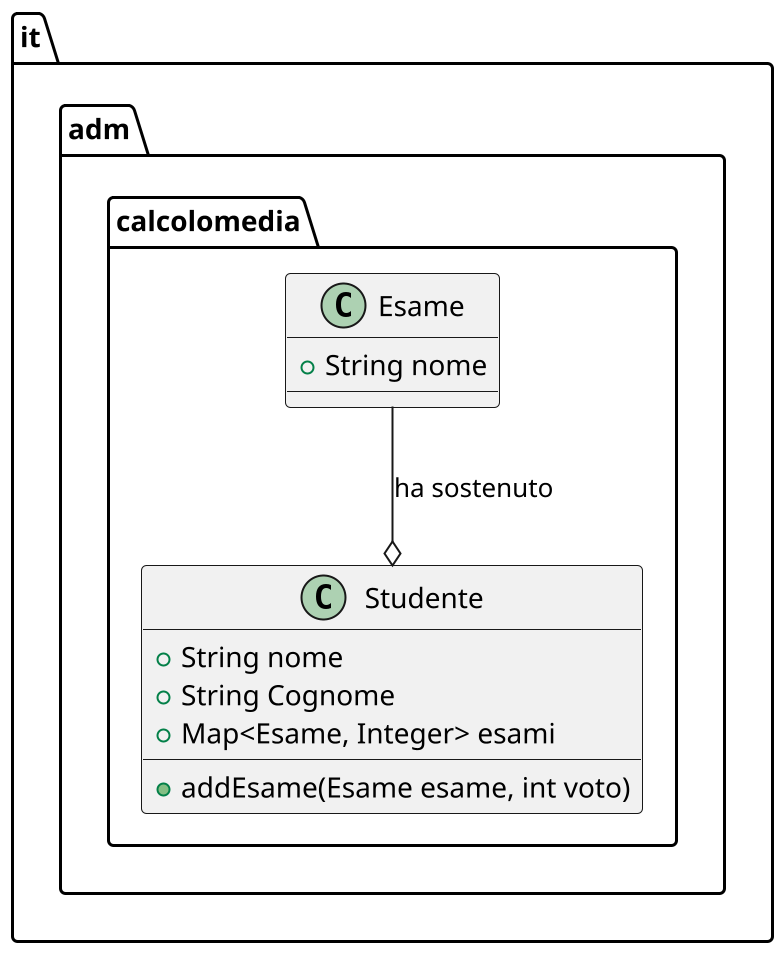
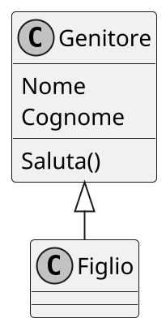

---
presentation:
    width: 1200
    height: 1200
    theme: simple.css
---
<style src="https://cdnjs.cloudflare.com/ajax/libs/font-awesome/4.7.0/css/font-awesome.min.css"></style>
<style>
.question {
    /* border: 2px solid #999999 !important; */
    border-radius: 30px;
    background-color: #e9e9ff;
    display: flex;
    box-shadow: 0px 10px 10px grey;
    margin: 30px !important;
}
.question .icon {
    display: flex;
    flex-grow: 1;
    justify-content: center;
    align-items: center;
    padding: 30px;
    font-size: 80px;
    color: #57578c;
}
.question .text {
    display: flex;
    flex-grow: 9;
    padding: 30px;
    align-items: center;
    color: #57578c;
    flex-direction: column;
}
</style>
<!-- slide -->

# Corso Java Base
## Ing. Sandro Zacchino
email sandro.zacchino@gmail.com
github https://github.com/szacchino/Lezione200219

<!-- slide  -->
## Problema
- Progettare le classi java necessarie ad elaborare la media degli esami sostenuti da un generico studente
- In questo problema riusciamo ad identificare due chiare entità: lo Studente e l'Esame
- In uno scenario reale i dati relativi ad uno studente potrebbero provenire da un database, da un file o da altre fonti

<!-- slide -->

## Progettazione
- Il nostro compito è quello di mappare le entità che hanno una definizione chiara in classi
- Le nostre classi saranno contenute in un package

<!-- slide -->

## Definizione di package
- Una classe ha un nome (solitamente con iniziale maiuscola) ed è definita all'interno di **package**.
- Un package è un contenitore con un nome che serve a distinguere classi che hanno lo stesso nome. Ad esempio
```java
package it.universita;
```
e
```java
package it.scuolasuperiore;
```
sono due package che potrebbero contenere una classe Studente ma le due classi potrebbero avere scopi e funzionamenti differenti
- All'interno di un package possono esserci più classi: per ciascuna possiamo indicare quale è visibile e quale no alle altri classi del contenitore.

<!-- slide -->

## Definizione di classe
- Una classe è la definizione di un tipo di dato complesso, dotato di uno stato interno e di metodi in grado di modificarlo
- lo **stato** è definito da attributi i quali possono essere di tipo primitivo (int, double, float, ecc) oppure di tipo complesso (altre classi)
- lo stato può comprendere tutte le classi *visibili* o sulle quali si ha accesso
- esistono le keyword di java che permettono di definire la visibilità di classi, attributi e metodi verso l'accesso da parte di una classe esterna

<table>
    <tr>
        <th>Modificatore</th>
        <th>Package</th>
        <th>Eredi</th>
        <th>Esterno</th>
        <th>Classe</th>
    </tr>
    <tr>
        <th>public</th>
        <td>Si</td>
        <td>Si</td>
        <td>Si</td>
        <td>Si</td>
    </tr>
    <tr>
        <th>protected</th>
        <td>Si</td>
        <td>Si</td>
        <td>No</td>
        <td>No</td>
    </tr>
    <tr>
        <th>private</th>
        <td>Si</td>
        <td>No</td>
        <td>No</td>
        <td>No</td>
    </tr>
</table>

<!-- slide -->

## Tipi di dati

- Java fornisce alcuni tipi di dati: alcuni di questi si identificano con *wrapper dei tipi primitivi*
- Questi wrapper sono le classi corrispondenti ai tipi primitivi
- i tipi primitivi ad esempio sono `int, float, double`
- i corrispondenti wrapper sono `Integer, Float, Double`
- l'uso dell'iniziale minuscola o maiuscola ci aiuta a capire quando stiamo usando un tipo primitivo e quando una classe

<!-- slide -->

## Diagramma delle classi
- Un primo progetto potrebbe essere rappresentato dal seguente diagramma UML (class diagram)

- **N.B.:** la presente non è necessariamente la soluzione finale

<!-- slide -->

## Un possibile schema di funzionamento
- Possiamo immaginare le nostre classi connesse ad altri pezzi del nostro sistema informativo

- **N.B. la parte tratteggiata non è parte dello standard UML**

<!-- slide -->

## Scrittura delle classi

- Ciascuna delle classi progettate andrà scritta in un file con lo stesso nome della classe ed estensione `.java`:
```
Studente.java
Esame.java
```

<!-- slide -->

## Studente.java
```java
package it.adm.calcolomedia;

public class Studente {
    public String nome;
    public String cognome;
    public Esame esami[];
}
```

<!-- slide -->

## Esame.java
```java
package it.adm.calcolomedia;

public class Esame {
    public String nome;
    public int voto;
}
```

<!-- slide -->

## Getters e Setters
- per quanto corrette, le suddette classi non seguono le *best practices* e non sfruttano i vantaggi che alcuni framework garantiscono a chi le segue 
- a meno di alcune eccezione lo stato di una classe dovrebbe essere definito con visibilità `private` 
- per consentire l'accesso in lettura o scrittura dello stato di una classe si utilizzano i metodi di tipo *getter* (per la lettura) o *setter* (per la scrittura): il nome di questi metodi è che il verbo *to get* indica *prendere* e il verbo *to set* indica *impostare*
- per ciascun attributo privato creeremo quindi dei semplici getter e setter (eclipse offre un automatismo per questo)

<!-- slide -->

## Studente.java
```java
package it.adm.calcolomedia;

public class Studente {
	private String nome;
	private String cognome;
	public Esame esami[];

	public String getNome() {
		return nome;
	}

	public void setNome(String nome) {
		this.nome = nome;
	}

	public String getCognome() {
		return cognome;
	}

	public void setCognome(String cognome) {
		this.cognome = cognome;
	}
}
```
- Per ora non scriviamo il getter/setter dell'attributo *esami*

<!-- slide -->

## La prima parte del programma
```java {.line-numbers}
package it.adm.calcolomedia;

public class TestEsame {
	public static void main(String[] args) {
		Studente studente = new Studente();
		studente.setNome("Mario");
		studente.setCognome("Rossi");
	}
}
```
- alla linea 5 creiamo una *istanza* della classe Studente invocando un metodo preceduto da **new**
<div class="question"><div class="icon"><i class="fa fa-question-circle" aria-hidden="true"></i></div><div class="text"><p> Dove è definito quel metodo? </p></div></div>

- nelle linee successive invece invochiamo i setter che alterano lo stato dell'istanza

<!-- slide -->

## Il costruttore
- La linea 5 del precedente listato crea una istanza della classe Studente invocando il costruttore
- Tutte le classi Java, anche quando non specificato, funzionano seguendo la definizione di una classe speciale chiamata Object
- Per questo motivo si dice che la classe Studente (così come la classe Esame) **eredita** dalla classe Object
- i tipi primitivi (int, float, double, ecc) non sono classi e quindi non ereditano alcun funzionamento da nessuno
- i wrapper dei tipi primitivi (Integer, Float, Double) invece sono classi
- quando nella classe manca il costruttore, viene invocato quello della classe madre (quindi quello di Object); stesso vale per gli altri metodi

<!-- slide -->

## Il costruttore 

- Il costruttore può essere scritto quando si vuole inizializzare l'istanza in modo particolare o in base a dei parametri
```java {.line-numbers}
public Studente(String nome, String cognome) {
    this.nome = nome;
    this.cognome = cognome;
    this.esami = new Esame[28];
}
```

- Alla linea 4 vediamo come si inizializza un array di istanze. 
- Alcuni framework potrebbero richiedere un costruttore senza parametri anche vuoto
<div class="question">
    <div class="icon"><i class="fa fa-question-circle" aria-hidden="true"></i></div>
    <div class="text">
        Cosa succede se nel main() aggiungiamo:
        System.out.println(studente.esami[0].getVoto());
    </div>
</div>

<!-- slide -->

## Aggiungiamo un esame

```java
package it.adm.calcolomedia;

public class TestEsame2 {
	public static void main(String[] args) {
		Studente studente = new Studente("Mario", "Rossi");
		studente.esami = new Esame[28];

		Esame esame = new Esame();
		esame.setNome("Analisi Matematica I");
		esame.setVoto(30);
		studente.esami[0] = esame;
		
		System.out.println(studente.esami[0].getVoto());
	}
}
```

<!-- slide -->

## Miglioramento del modello

- Cosa succede se più studenti fanno lo stesso esame?
- Cosa occorre rimodellare per ottimizzare la gestione delle informazioni?

<!-- slide -->

## Class Diagram



<!-- slide -->

## Ereditarietà


<!-- slide -->

## Ereditarietà
- Consente di definire tipi e sottotipi che godono di specifiche proprietà:

- Le proprietà del genitore possono essere ereditate dal figlio.
- **Motivazione** L'ereditarietà consente di specializzare/estendere il funzionamento di una classe senza modificare il codice del genitore. Questa caratteristica rafforza la **modularità** e la **manutenibilità** del codice.

<!-- slide  -->
## Esempio di ereditarietà
<div style="float: left">


</div>
<div style="float: right">

```java
public class Genitore {
    private String nome;
    private String cognome;
    // getters / setters / constructor
    public String saluta() {
        return nome + " " + cognome;
    }
}
```
```java
public class Figlio extends Genitore {
    // constructor
    public String saluta() {
        return super.saluta + " ma sono figlio";
    }
}
```
</div>

<!-- slide -->

## Tipi di ereditarietà

- **Interfacce**: rappresentano delle classi che non possono essere instanziate ma presentano un modo comune di presentarsi: 
    - gli attributi devono essere `public static final`
    - non devono avere costruttori
    - i metodi devono essere `public`, `abstract`
    - è convenzione premettere una "I" al nome della classe
- **Abstract**: rappresentano classi con almeno un metodo astratto, non possono essere istanziate:
    - gli attributi possono essere di qualunque tipo;
    - possono avere costruttori
    - è convenzione premettere "Abstract" al nome della classe;
Quando una classe implementa una interfaccia va dichiarata come:
```java
public class Figlio implements IGenitore {}
```
Quando una classe estende una classe astratta o concreta si dichiara come:
```java
public class Figlio extends Genitore {}
```

<!-- slide -->

## Classe astratta

- Si tratta di classi che implementano parzialmente alcune funzionalità, lasciandone altre alle classi figlie.
- Una classe astratta *non può essere istanziata*
- I metodi non implementati si identificano con il modificatore `abstract`


<!-- slide -->

## Esempio (Factory Design Pattern)
```puml
scale 2
skinparam monochrome true
left to right direction

interface IProduct {
    String getName()
    void setPrice()
}

class Phone {
    - double price
    String getName()
}

abstract class ProductAbstractFactory {
    #IProduct makeProduct()
    +IProduct getObject()
}

class PhoneConcreteFactory {
    IProduct makeProduct()
}

IProduct <|--Phone
ProductAbstractFactory --> IProduct
ProductAbstractFactory <|--PhoneConcreteFactory
PhoneConcreteFactory..>Phone
```


<!-- slide -->

## Esempio (Factory Design Pattern)

```java
public interface IProduct
{
    String getName();
    void setPrice(double price);
}

public class Phone implements IProduct 
{
    private double price;

    public String getName() {
        return "Apple iPhone";
    }

    public void setPrice(double price) {
        this.price = price;
    }
}

```

<!-- slide -->

## Esempio (Factory Design Pattern)

```java

public abstract class ProductAbstractFactory
{
    protected abstract IProduct makeProduct();

    public IProduct getObject() {
        return this.makeProduct();
    }
}

public class PhoneConcreteFactory extends ProductAbstractFactory
{
    protected override IProduct makeProduct() {
        IProduct product = new Phone();
        product.setPrice(1100);
        return product;
    }
}
```

<!-- slide -->

## Collections
- È una libreria che contiene strutture dati di uso comune
- Alcuni esempi di interfacce:
    - List
    - Map
- ed le corrispondenti classi concrete:
    - ArrayList
    - HashMap
- dichiareremo sempre variabili utilizzando le interfacce ma le istanzieremo usando le classi concrete


<!-- slide -->

## Collections
- Le collections possono essere tipizzate oppure no:
    - Una collection non tipizzata può contenere oggetti di tipo diverso
    - Una collection tipizzata può contenere solo oggetti di un tipo specifico


<!-- slide -->

## Esempio
```java
List lista = new ArrayList();
lista.add("Ciao");
lista.add(3);
System.out.println(lista.toString());
```


<!-- slide -->

## Esempio
```java
List<String> lista = new ArrayList<String>();

// In alternativa 
// List<String> lista = new ArrayList<>();

lista.add("Ciao");
lista.add("Mondo");
System.out.println(lista.toString());
```


<!-- slide -->

## Literals

- Per inizializzare un array possiamo usare il literal:

```java
Integer[] numeri = {30, 10, 20};
```

- Per inizializzare una lista:

```java
List<Integer> numList = Arrays.asList(numeri);
// Oppure
List<Integer> numList = Arrays.asList(10, 30);
// Oppure
List numList = Arrays.asList(10, "ciao", true);
```