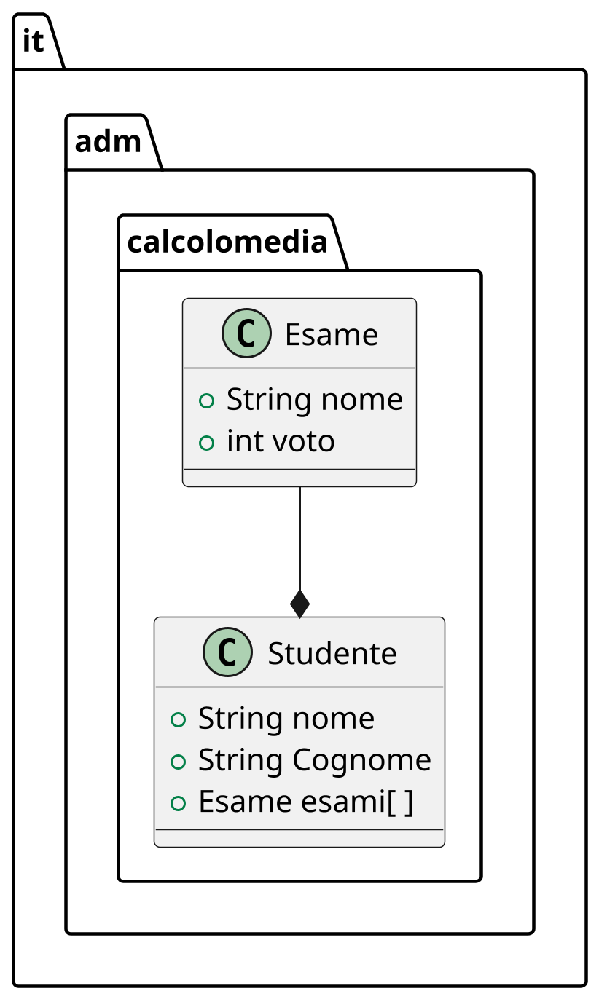

---
presentation:
    width: 1200
    height: 1200
    theme: simple.css
---
<style src="https://cdnjs.cloudflare.com/ajax/libs/font-awesome/4.7.0/css/font-awesome.min.css"></style>
<style>
.question {
    /* border: 2px solid #999999 !important; */
    border-radius: 30px;
    background-color: #e9e9ff;
    display: flex;
    box-shadow: 0px 10px 10px grey;
    margin: 30px !important;
}
.question .icon {
    display: flex;
    flex-grow: 1;
    justify-content: center;
    align-items: center;
    padding: 30px;
    font-size: 80px;
    color: #57578c;
}
.question .text {
    display: flex;
    flex-grow: 9;
    padding: 30px;
    align-items: center;
    color: #57578c;
    flex-direction: column;
}
</style>
<!-- slide -->

# Corso Java Base
## Ing. Sandro Zacchino
email sandro.zacchino@gmail.com
github https://github.com/szacchino/Lezione200219

<!-- slide  -->
## Problema
- Progettare le classi java necessarie ad elaborare la media degli esami sostenuti da un generico studente
- In questo problema riusciamo ad identificare due chiare entità: lo Studente e l'Esame
- In uno scenario reale i dati relativi ad uno studente potrebbero provenire da un database, da un file o da altre fonti

<!-- slide -->

## Progettazione
- Il nostro compito è quello di mappare le entità che hanno una definizione chiara in classi
- Le nostre classi saranno contenute in un package

<!-- slide -->

## Definizione di package
- Una classe ha un nome (solitamente con iniziale maiuscola) ed è definita all'interno di **package**.
- Un package è un contenitore con un nome che serve a distinguere classi che hanno lo stesso nome. Ad esempio
```java
package it.universita;
```
e
```java
package it.scuolasuperiore;
```
sono due package che potrebbero contenere una classe Studente ma le due classi potrebbero avere scopi e funzionamenti differenti
- All'interno di un package possono esserci più classi: per ciascuna possiamo indicare quale è visibile e quale no alle altri classi del contenitore.

<!-- slide -->

## Definizione di classe
- Una classe è la definizione di un tipo di dato complesso, dotato di uno stato interno e di metodi in grado di modificarlo
- lo **stato** è definito da attributi i quali possono essere di tipo primitivo (int, double, float, ecc) oppure di tipo complesso (altre classi)
- lo stato può comprendere tutte le classi *visibili* o sulle quali si ha accesso
- esistono le keyword di java che permettono di definire la visibilità di classi, attributi e metodi verso l'accesso da parte di una classe esterna

<table>
    <tr>
        <th>Modificatore</th>
        <th>Package</th>
        <th>Eredi</th>
        <th>Esterno</th>
        <th>Classe</th>
    </tr>
    <tr>
        <th>public</th>
        <td>Si</td>
        <td>Si</td>
        <td>Si</td>
        <td>Si</td>
    </tr>
    <tr>
        <th>protected</th>
        <td>Si</td>
        <td>Si</td>
        <td>No</td>
        <td>No</td>
    </tr>
    <tr>
        <th>private</th>
        <td>Si</td>
        <td>No</td>
        <td>No</td>
        <td>No</td>
    </tr>
</table>

<!-- slide -->

## Tipi di dati

- Java fornisce alcuni tipi di dati: alcuni di questi si identificano con *wrapper dei tipi primitivi*
- Questi wrapper sono le classi corrispondenti ai tipi primitivi
- i tipi primitivi ad esempio sono `int, float, double`
- i corrispondenti wrapper sono `Integer, Float, Double`
- l'uso dell'iniziale minuscola o maiuscola ci aiuta a capire quando stiamo usando un tipo primitivo e quando una classe

<!-- slide -->

## Diagramma delle classi
- Un primo progetto potrebbe essere rappresentato dal seguente diagramma UML (class diagram)



- **N.B.:** la presente non è necessariamente la soluzione finale
